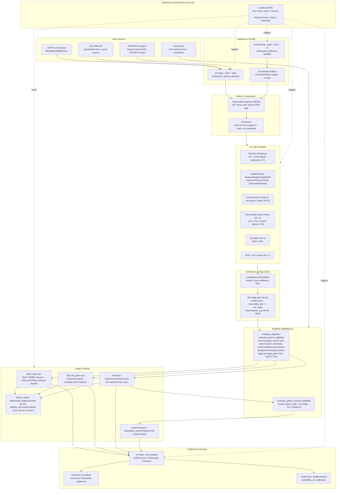
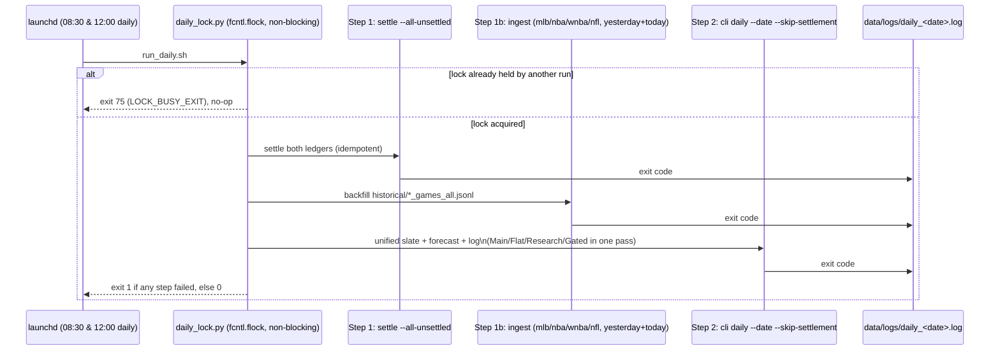

# model-prediction

Shadow-first multi-sport prediction, research, ledger, and local dashboard
system with Polymarket US market-data integration.

The repository also contains an isolated clean-slate shadow rebuild under
`src/model_prediction/rebuild`. Use `rebuild-shadow --help` for its separate
CLI and read [`docs/rebuild/README.md`](docs/rebuild/README.md) before operating
it. Rebuild output cannot submit live orders, write incumbent ledgers, or
promote a model into production.

**Last updated**: 2026-08-23

The current operational verdict and audit evidence live in
[`docs/PROJECT_STATUS.md`](docs/PROJECT_STATUS.md) and [`docs/MASTER.md`](docs/MASTER.md).
Complete documentation index lives in **[`docs/INDEX.md`](docs/INDEX.md)**.

## Current State

| Metric | Value |
|--------|-------|
| Tests | **2,205 passed, 3 skipped, 0 failed** (2026-08-23) |
| Ruff | **0 findings** (clean across `src/`, `tests/`, and `scripts/`) |
| Type safety | `src/model_prediction/py.typed` marker + library overrides |
| Git | `main` / `research/mlb-v9` (clean branch topology) |
| CI | `.github/workflows/ci.yml` — ruff + pytest on push/PR |
| Documentation | Consolidated under [`docs/`](docs/) (master index: [`docs/INDEX.md`](docs/INDEX.md)) |

Do not infer executable profitability from artifact hit rates, synthetic
`-110` units, shadow-ledger P&L, or a dashboard qualification badge.

## What's Wired (live in `daily`) and What Feeds It

The operating question for this project day-to-day is **not** "is this model
validated" — it's "is this model actually running, and on what data."

| Sport | Wired in `daily`? | Model / features it actually runs on | Ledger it writes to |
|---|---|---|---|
| MLB moneyline | Yes | `learned_forward.py` — Elo + trend logistic regression (v7 artifact) | Main + Flat |
| MLB totals & spread | Yes | `models/mlb.py` `MeasuredEdgeTotalsModel`/margin — Gamma-Poisson mixture Monte-Carlo, priced against real Polymarket lines | Main + Flat |
| NBA moneyline | Yes | `learned_forward.py` — Elo + trend logistic regression (v4 artifact) | Flat only (not promoted to Main) |
| WNBA moneyline | Yes | `learned_forward.py` — Elo + trend logistic regression (v4 artifact) | Main + Flat |
| WNBA spread | Yes (since 2026-08-14) | `models/basketball.py` — margin-normal CDF (`wnba-spread-margin-v1`) | Main + Flat |
| NFL moneyline | Yes (offseason) | `learned_forward.py` — Elo + trend logistic regression (v4 artifact) | Flat only (not promoted to Main) |
| Soccer | Yes | Poisson-Dixon-Coles (`soccer-poisson-dc-v1`) — moneyline, totals, BTTS | Main + Flat |
| Tennis | Yes | WTA + ATP surface Elo (`tennis-surface-elo-v1`) | Main + Flat |
| LOL | Yes | Platt-scaled neutral series Elo (v5) | Research + Gated Research |
| CS2 | Yes | Platt-scaled neutral series Elo (v5) | Research + Gated Research |
| Dota 2 | Yes | Platt-scaled neutral series Elo (v5) | Research + Gated Research |
| Valorant | Yes | Platt-scaled neutral series Elo (v5) | Research + Gated Research |
| Rainbow Six | Yes | Platt-scaled neutral series Elo (v5) | Research + Gated Research |
| KBO | Yes | Tie-aware Elo (v2) | Research + Gated Research (no Polymarket markets exist) |
| NPB | Yes | Tie-aware Elo (v2) | Research + Gated Research (no Polymarket markets exist) |

## Key design decisions (as of 2026-08-03)

- **Main ledger (MLB/WNBA/Soccer/Tennis)**: "show everything, I decide" — no automated
  gate hides a real pick. Operator is the final filter. MLB spreads/totals also route
  to Main alongside moneyline.
- **Gated Research (esports)**: "Research shows everything, Gated should mean
  something" — curated tier is deliberately tightened. Soccer and tennis moved to
  Main+Flat only per operator directive 2026-08-03.
- **Unit sizing**: 1.0U–2.0U range, with `model_uncertainty` now actually
  haircutting the edge (was a dead parameter for months; fixed 2026-07-31).
- **New Model Ledger** (`model_ledger.py`): additive architecture — one `.xlsx`
  per model identity, no classification field, operator-decision block separate
  from model output. Existing `PickLedger` unchanged; migration not yet cut over.
- **Dashboard auth**: per-session token on the real-money order-execution endpoint
  (added 2026-08-02; was previously unauthenticated).

## Pipelines & Workflows

Everything in this repo ultimately feeds one of four ledgers. The diagram below
is the full path from raw data to a settled, reviewed pick; the sections after
it walk through each distinct workflow (scheduled daily run, manual forecast,
settlement, backfill, dashboard, and the separate real-money surface).



### 1. Scheduled daily pipeline (`scripts/run_daily.sh`, launchd twice daily)

`~/Library/LaunchAgents/com.modelprediction.daily.plist` fires this script
at 08:30 and 12:00 local time, with a `TimeOut=1800` (30min) watchdog. The checked-in
source is `ops/launchd/com.modelprediction.daily.plist`. It has no `RunAtLoad`,
so login or service reloads do not launch an extra full pipeline. The
script wraps its entire body in a single OS-level lock so an overlapping
scheduled run and a manual invocation can never interleave and corrupt a
ledger write:



- **Step 1 — Settlement**: grades every open pick that has started, across
  both Main and Flat, from ESPN scoreboards (US sports) or Polymarket
  resolution (esports/soccer). Idempotent — safe to re-run.
- **Step 1b — Historical ingestion**: feeds completed games into
  `data/historical/*_games_all.jsonl`, the dataset every rolling feature
  (Elo, trend, park, pitcher ERA gap) reads via `FeatureStore.games_before()`.
  This is separate from settlement — settlement grades ledger picks, ingestion
  advances the model's own historical record. Runs for yesterday and today so
  a single missed run self-heals on the next one.
- **Step 2 — Unified daily forecast**: one `cli daily --date ... --skip-settlement`
  call computes the day's slate once and fans it out to every ledger (Main,
  Flat, Research, Gated Research) in a single pass, replacing the older
  two-step forecast/flat-forecast approach.

### 2. Per-pick evaluation (forecast / flat-forecast / esports-forecast / international-forecast)

For every candidate game, in order:

1. A per-sport model produces `model_probability` and `model_uncertainty`.
2. **`candidate.call`** — the model's own confidence threshold (e.g. v7's
   MLB threshold) must clear first, or the game never reaches the gates below.
3. **Ask-edge gate** — `model_probability - executable_ask >= min_edge`
   (e.g. 5% for MLB), using the real vig-inclusive tradeable price. This is
   stricter than the no-vig "Decision edge" shown on the dashboard.
4. **`eligibility.py`** — `evaluate_eligibility`/`evaluate_esports_eligibility`
   run only trust-boundary checks (banned team, stale data, model
   validation/provenance). Per the 2026-07-26 operator directive, market
   disagreement, exposure caps, and low edge no longer block a CALL — they
   only affect sizing (`edge_scaled_units()`), never the decision itself.
5. **`evaluate_gated_research_eligibility`** — a second, additive filter that
   only applies to the Research → Gated Research promotion (esports/soccer/
   tennis/KBO/NPB), requiring `model_inputs_valid`, a minimum edge, and a
   minimum confidence.

### 3. Ledger routing

See [`docs/LEDGER_ROUTING.md`](docs/LEDGER_ROUTING.md) for the authoritative
per-sport rules. In short:

- **Main** (`picks.xlsx`) — MLB, WNBA, Soccer. "Show everything, operator
  decides." No gate hides a real candidate from Main.
- **Flat** (`flat_picks.xlsx`) — every learned sport, complete slate,
  zero-exposure-aware diagnostic baseline for comparing against Main.
- **Research** (`data/research/{sport}.xlsx`) — one workbook per sport for
  esports/soccer/tennis/KBO/NPB; always logs every candidate, including
  zero-unit `NO_CALL_*` rows.
- **Gated Research** (`data/gated_research/{sport}.xlsx`) — the curated
  subset of Research that clears `evaluate_gated_research_eligibility`.
- **Model Ledger** (`data/model_ledgers/{model-id}.xlsx`) — new, additive,
  one workbook per model identity (e.g. `mlb-moneyline-elo-trend-lr.xlsx`),
  written alongside the existing `PickLedger` on every `append_evaluated`
  call. Not yet the primary source of truth — a parallel structure, not a
  replacement.

### 4. Settlement & review

`cli settle --all-unsettled` grades every open pick across all ledgers.
Esports picks whose Polymarket market expired with a non-binary settlement
price (e.g. 0.09/0.91, never resolved to 0/1) are voided rather than left
open forever. Settled losses get flagged `review_required` until
`cli review-loss` records a cause and disposition; `cli update-closing`
attaches verified closing lines/odds after the fact for CLV calculation
without mutating the original decision.

### 5. Manual / one-off commands

| Command | Purpose |
|---|---|
| `bootstrap` / `bootstrap-entities` | idempotent historical backfill from ESPN; merge team lists into the entity registry |
| `esports-backfill` / `international-backfill` | historical backfill for esports and KBO/NPB |
| `features` | compute a point-in-time feature snapshot on demand |
| `backtest` / `validate` / `total-validate` | walk-forward chronological backtests and model validation |
| `call` | freeze one pre-game prediction manually, bypassing the automated slate |
| `void` / `review-loss` / `update-closing` | manual ledger corrections and settlement follow-up |
| `ban-team [add\|remove\|list]` | manage the team ban list used by the trust-boundary check |
| `verify-chain` | replay the audit log and confirm no ledger row was mutated out-of-band |
| `polymarket-ledger-prices` / `polymarket-clv` | refresh live quotes for open picks; compute probability CLV |
| `collect-scores` | pull recent soccer scores from The Odds API |
| `score-research` | compute reason/edge for a research candidate without logging it |

### 6. Dashboard (`dashboard_server.py`, `localhost:8765`)

The dashboard is a thin trigger + read layer over the same CLI — its buttons
shell out to the identical commands used by the scheduled pipeline, so there
is only one forecast/settlement code path regardless of how it's invoked:

| Dashboard button | Command it runs |
|---|---|
| Run Tests | `pytest tests/ -q --no-header` |
| Daily | `run_supervisor run daily` → `scripts/run_daily.sh` (full locked settle → ingest → daily pipeline) |
| Ledger / Research / Gated tabs → Forecast | `cli forecast --all --date ... --log --replace-today --model learned` |
| Flat tab → Forecast | `cli flat-forecast --all --date ... --log` |
| Refresh Prices | `cli polymarket-ledger-prices --date ...` (one `--contract` per open, unarchived pick) |
| Settle | `cli settle --all-unsettled` |
| Bootstrap | `cli bootstrap --sport ... --from ... [--to ...]` |

### 7. Real-money execution surface (separate, heavily gated)

`execute` and `sell-position` place and close real Polymarket orders. This
path is architecturally separate from every shadow ledger above, requires
its own authenticated dashboard endpoint (added 2026-08-02), and is currently
**not released for real money** per [`docs/PROJECT_STATUS.md`](docs/PROJECT_STATUS.md)'s Release verdict
repair of known execution-binding and ledger/audit transaction defects. None
of the workflows above ever touch real money — Main, Flat, Research, and
Gated Research are shadow/paper-trading only.

## Quick start

```bash
# Run tests
env PYTHONPATH=src:. .venv/bin/python -m pytest tests/ -q

# Lint
.venv/bin/ruff check src/ tests/

# See daily forecast
env PYTHONPATH=src:. .venv/bin/python -m model_prediction.cli daily --date $(TZ=America/New_York date +%Y-%m-%d)

# Verify audit chain
env PYTHONPATH=src:. .venv/bin/python -m model_prediction.cli verify-chain

# Dashboard
python3 dashboard_server.py  # then open http://127.0.0.1:8765/
```

## Documentation index

- [`docs/PROJECT_STATUS.md`](docs/PROJECT_STATUS.md) — operational status and release verdict
- [`docs/BURN_IN.md`](docs/BURN_IN.md) — burn-in window checks + results (through 08-18)
- [`docs/ROADMAP.md`](docs/ROADMAP.md) — consolidated roadmap: promotion rules, verdict taxonomy, open research items (MLB v9 first)
- [`docs/V8_REPRODUCTION.md`](docs/V8_REPRODUCTION.md) — v8 reproduction contract + parity findings (on the `research/mlb-v8-reproduction` branch)
- [`docs/archive/`](docs/archive/) — one-shot investigation records and dated artifacts
- [`docs/HISTORY.md`](docs/HISTORY.md) — chronological project history, all phases
- [`DEBUG.md`](DEBUG.md) — full audit history, every bug found/fixed with trace
- [`docs/ARCHITECTURE.md`](docs/ARCHITECTURE.md) — durable architecture contract
- [`docs/LEDGER_ROUTING.md`](docs/LEDGER_ROUTING.md) — which sport goes into which ledger
- [`docs/MODEL_IMPROVEMENTS.md`](docs/MODEL_IMPROVEMENTS.md) — per-sport feature roadmap
- [`docs/ENGINEERING_ROADMAP.md`](docs/ENGINEERING_ROADMAP.md) — code quality, tests, dashboard gaps
- [`docs/AGENTS.md`](docs/AGENTS.md) — execution rules (walk-forward only, protected files, etc.)
- [`docs/FEATURE_REGISTRY.md`](docs/FEATURE_REGISTRY.md) — what's been tested, what must not be re-tested
- [`CLAUDE.md`](CLAUDE.md) — working guidelines auto-loaded into every session
- [`CHECKLIST.md`](CHECKLIST.md) — maintenance checklist (daily/weekly/monthly)
